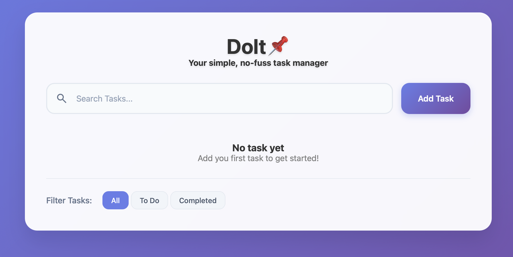

# Dolt 📌

**Dolt** is a clean, minimalist task manager app built with **HTML**, **CSS**, and **vanilla JavaScript**.  
Designed for simplicity and speed, it lets you focus on getting things done — without distractions.

> ✅ _“Your simple, no-fuss task manager”_

---

## 🌐 Live Demo

👉 [Try Dolt Online](https://gtwb.github.io/dolt/)

---

## ✨ Features

- ✅ Add tasks with a **title and description**
- 🔎 **Live search** to quickly find tasks
- 🧹 Filter by:
  - All tasks
  - Completed
  - To Do
- ☑️ Mark tasks as completed (with persistent state)
- 🗑️ Delete individual tasks or clear the entire list
- 💾 Tasks are **saved in localStorage**
- 📱 Responsive layout with subtle animations

---

## 📸 Screenshot



---

## 🛠️ Built With

- HTML5 + CSS3 (responsive + animation)
- JavaScript (ES6+)
- GitHub Pages for deployment

---

## 🚀 Getting Started

To run it locally:

```bash
git clone https://github.com/gtwb/dolt.git
cd dolt
open index.html
```
